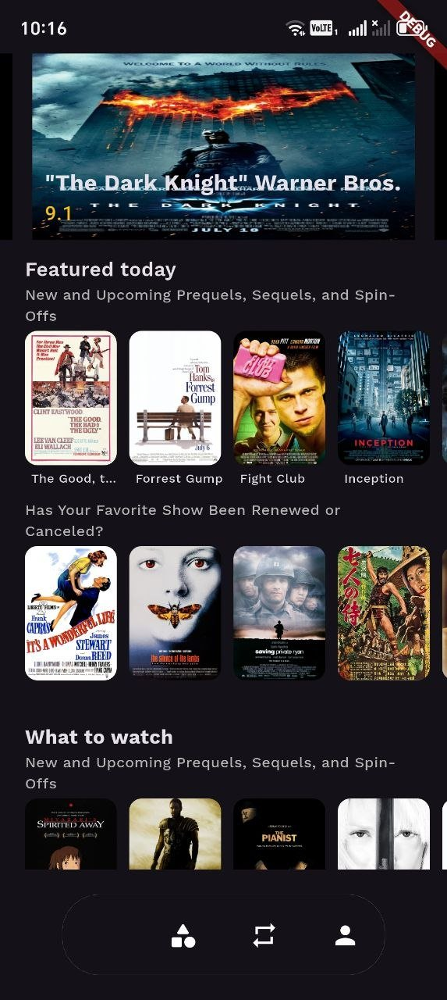
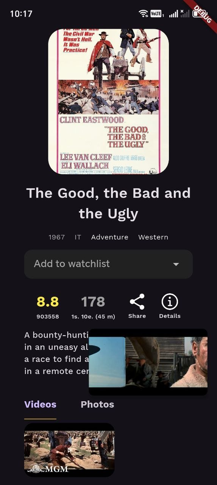
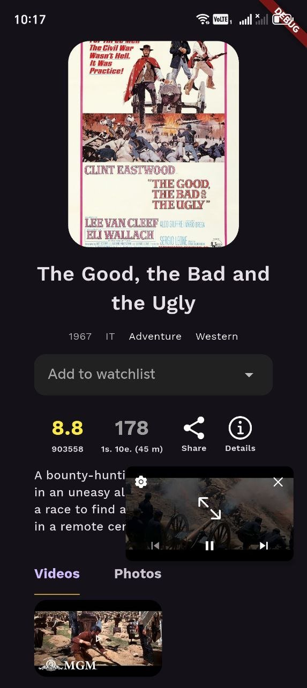

<h1 align="center">🎬 IMDb App</h1>

<p align="center">
  A movie discovery app built with Flutter — browse IMDb's Top 250, open rich movie details and watch trailers right inside the app.
</p>

<p align="center">
  
  
  
  
</p>

---

## 📱 Screenshots

<p align="center">
  
  &nbsp;&nbsp;
  
  &nbsp;&nbsp;
  
</p>

<p align="center">
  <sub><b>Home</b> &nbsp;•&nbsp; <b>Movie details</b> &nbsp;•&nbsp; <b>Floating trailer player</b></sub>
</p>

## ✨ Features

- 🏆 **IMDb Top 250** movies loaded from a live API
- 🎞️ **Hero carousel** with featured movies and ratings
- 📂 Curated horizontal sections — *Featured today*, *What to watch* and more
- 📄 **Movie details**: poster, year, genres, rating, vote count, runtime and description
- ▶️ **Trailer preview** in a floating mini-player with Videos / Photos tabs
- 🔗 **Share** movies and open external links
- 🌐 **No-internet screen** with connectivity checks
- ⚡ Shimmer loading and cached network images

## 🛠️ Tech Stack

| Category | Packages |
|---|---|
| State management | `provider` |
| Networking | `http` (IMDb API via RapidAPI) |
| UI | `carousel_slider`, `crystal_navigation_bar`, `shimmer`, `google_fonts`, `flutter_svg` |
| Media & images | `cached_network_image` |
| Utilities | `connectivity_plus`, `share_plus`, `url_launcher`, `intl` |

## 📁 Project Structure

```
lib/
├── models/       # Movie data model
├── service/      # API service
├── router/       # App routing
├── screens/      # Home, details, no-internet screens
└── widgets/      # Carousel, tab bar, trailer preview, layouts
```

## 🚀 Getting Started

```bash
git clone https://github.com/azamat23012010-ui/imdb_app.git
cd imdb_app
flutter pub get
cp env.example.json env.json   # then put your key inside env.json
flutter run --dart-define-from-file=env.json
```

> 🔑 Get an API key for the [IMDb API on RapidAPI](https://rapidapi.com). `env.json` is git-ignored, so your key never gets committed.

---

<p align="center">Made with 💙 by <a href="https://github.com/azamat23012010-ui">Azamat</a></p>
